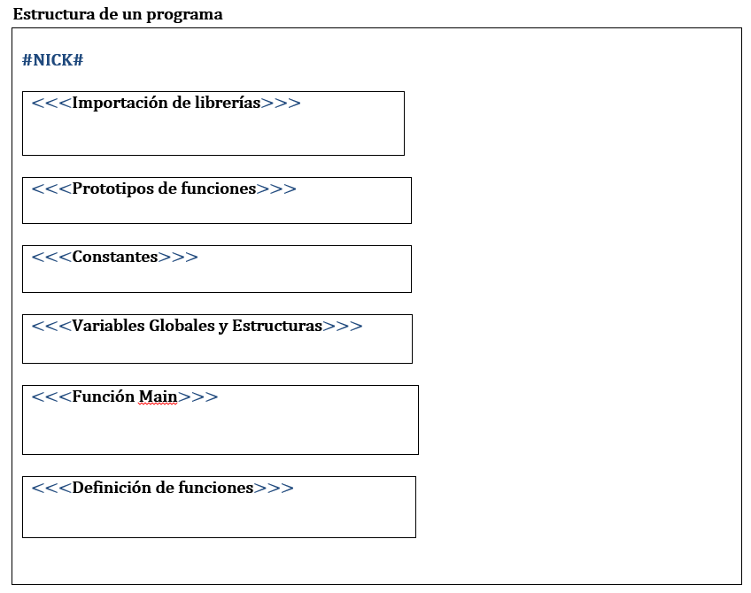

# LENGUAJE DEUX EX-MACHINA

El presente repositorio contiene un informe detallado sobre un ejercicio académico desarrollado para un curso de compiladores, en el cual se implemento un pequeño compilador en python para un lenguaje ficticio llamado "DEUS EX-MACHINA"

Se describirá formalmente cada una de las etapas de la construcción del compilador como lo son:

### El análisis Léxico.

Consiste en leer texto o código del programa fuente carácter a carácter e irlos agrupando generando los tokens, los cuales tienen un significado para el lenguaje. Estos constituyen la entrada para la el análisis sintáctico.

Resumiendo, las funciones del análisis léxico son:

* Agrupar caracteres según categorías establecidas por la especificación del lenguaje fuente
* Rechazar texto con caracteres ilegales o agrupados según un criterio no especificado.

### Análisis Sintáctico.

Consiste en comprobar que los tokens que le suministra el analizador léxico van ordenados según la especificación de la gramática de nuestro lenguaje a compilar “DEUS EX-MACHINE”. Y si no es así, dar los mensajes de error adecuados, pero continuar funcionando sin detenerse, hasta que llegue al final del fichero de entrada. Es esencial que el proceso de análisis no se detenga en el primer error encontrado, ya que así podremos dar información al usuario en un solo informe de todos los errores generados.

## DEFINICION

El compilador definido sobre el lenguaje de programación “DEUS EX-MACHINA” el cual traduce “Dios surgido de la maquina” es un lenguaje imperativo estructurado. Es un lenguaje pequeño, sencillo, con fines propiamente académicos y no está especializado en ningún tipo de aplicación.

### DESCRIPCION

Las especificaciones del lenguaje se definen a continuación:

* Se usa una notación prefija para definir expresiones aritmeticologicas.
* Se permite la importación de librerías o código externo mediante el comando “importar” seguido de la ruta del archivo, este debe ir al comienzo del programa o fichero de entrada.
* Una importante función de inicio de programa, llamada función “principal”. Este se ubicara en cualquier parte después de la definición de prototipos, constantes y variables globales.
* Las variables o identificadores de funciones, arreglos etc, las representa el token NICK.
* Se permite la definición de constantes, las cuales se definirán con la palabra “constante” seguido del tipo y su valor, estas deben definirse justo después de la importación de librerías y antes de la definición del bloque principal.
* La esencia de todo lenguaje de programación son las funciones, en nuestro lenguaje “DEUS EX-MACHINE”, estas deben definirse mediante un prototipo, el cual contiene:

  * Tipo de dato a retornar.
  * El Token “macro”.
  * NICK que identifica a la funcion.
  * Cero, uno o más definición de parametros.

* La definición de prototipos se ubicara justo después de la definición de librerias y antes del bloque principal. Toda función debe estar definida por su prototipo, esto facilita la creación de la tabla de símbolos. Lo adicional a la funcion como:

  * Conjunto de cero, una o más sentencias a ejecutar
  * Valor de retorno.

* Se podrá definir en cualquier lugar después del prototipado del fichero del programa. Se permitirá la sobre carga de funciones. Para el llamado a funciones se requerirá del NICK de la funcion seguido de su conjunto de parametros. Para los parametros se permitirá todo tipo de valores y expresiones siempre y cuando el valor referente a estas corresponda con el tipo de
dato del prototipo de la funcion.
* No se permitirán valores nulos.
* Se definen 5 tipos de datos básicos: entero, real, carácter, cadena y booleano.
* Se permite la definición de estructuras, que funcionan como nuevos tipos de dato, mediante la palabra “estructura”.
* Como es de esperar el conjunto de los enteros y reales permite números negativos y positivos.
* Se permite la definición de arreglos unidimensionales usando el NICK para identificar al arreglo y los tokens IZQCORCHET(“[“) y DERCORCHET(“]“).

### Estructura de los componentes del lenguaje:

A continuación se muestra de manera muy general los componentes del lenguaje.

[PARA SEGUIR LEYENDO MÁS SOBRE LA DEFINICIÓN DEL LENGUAJE, VER INFORME COMPLETO AQUÍ.](COMPILADOR.pdf)